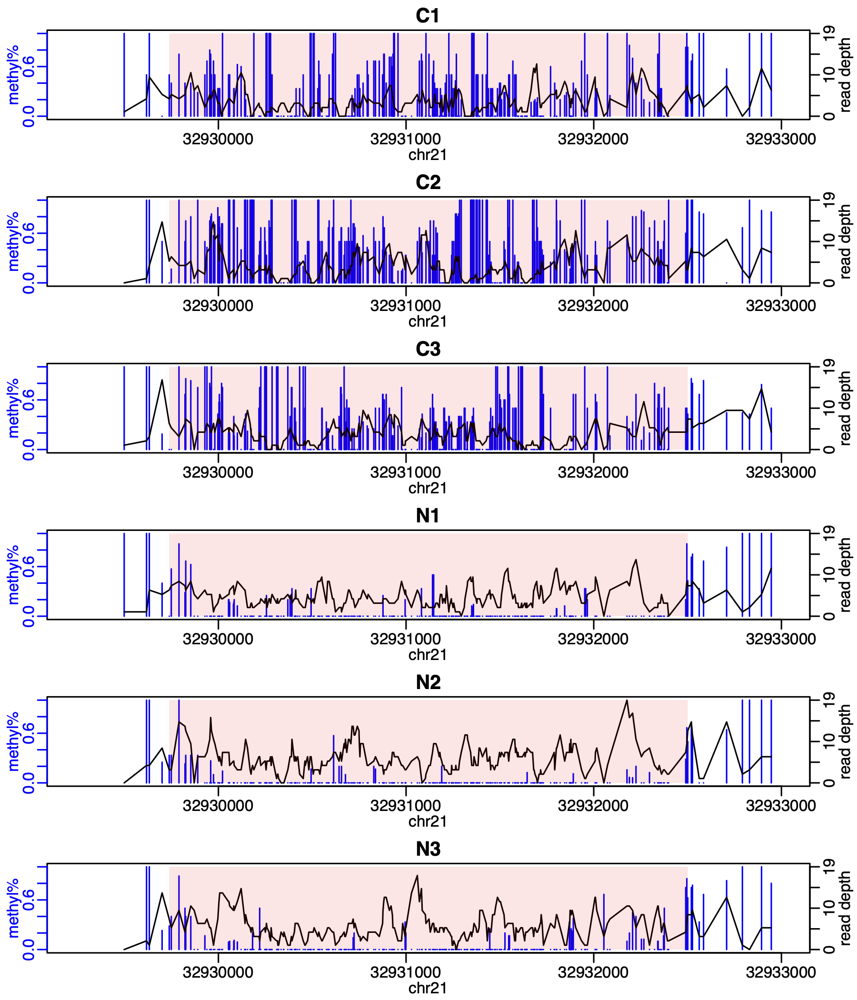
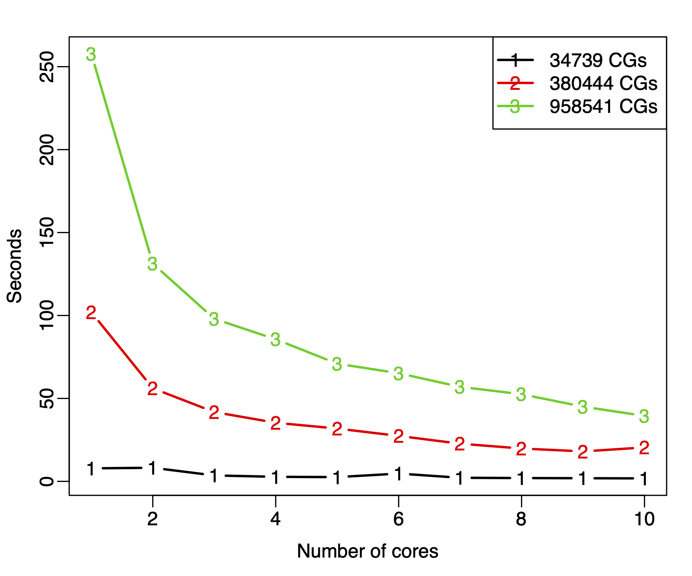

# Introduction

## Background

Recent advances in various high-throughput sequencing technologies have
revolutionized genomics research. Among them,
RNA-seq is designed to measure the the abundance of RNA products,
and Bisulfite sequencing (BS-seq) is for measuring DNA methylation.
A fundamental question in functional genomics research
is whether gene expression or DNA methylation
vary under different biological contexts.
Thus, identifying differential expression genes (DEGs)
or differential methylation loci/regions (DML/DMRs)
are key tasks in RNA-seq or BS-seq data analyses.

The differential expression (DE) or differential methylation (DM) analyses
are often based on gene- or CpG-specific statistical test.
A key limitation in RNA- or BS-seq experiments
is that the number of biological replicates is usually limited due to cost constraints.
This can lead to unstable estimation of within group variance,
and subsequently undesirable results from hypothesis testing.
Variance shrinkage methods have been widely applied in DE analyses in
microarray data to improve the estimation of gene-specific within group variances.
These methods are typically based on a Bayesian hierarchical model,
with a prior imposed on the gene-specific variances to provide
a basis for information sharing across all genes.

A distinct feature of RNA-seq or BS-seq data is that the measurements are
in the form of counts and have to be modeld by discrete distributions.
Unlike continuous distributions such as Gaussian,
the variances depend on means in these distributions.
This implies that the sample variances do not account for biological variation,
and shrinkage cannot be applied on variances directly.
In DSS, we assume that the count data are
from the negative-binomial (for RNA-seq) or beta-binomial (for BS-seq) distribution.
We then parameterize the distributions by a mean and a dispersion parameters.
The dispersion parameters, which represent the biological variation for
replicates within a treatment group, play a central role in the differential analyses.

DSS implements a series of DE/DM detection algorithms based on the
dispersion shrinkage method followed by Wald statistical test
to test each gene/CpG site for differential expression/methylation.
It provides functions for RNA-seq DE analysis for both two group comparision and multi-factor design,
BS-seq DM analysis for two group comparision, multi-factor design, and data without biological replicate.

For more details of the data model, the shrinkage method, and test procedures,
please read [@DE] for differential expression from RNA-seq,
[@DML] for differential methylation for two-group comparison from BS-seq,
[@DMR1] for differential methylation for data without biological replicate,
and [@DML-general] for differential methylation for general experimental design.

## Citation

* For differential expression in RNA-seq, cite @DE. 
* For general differential methylation in BS-seq, cite @DML. 
* For differential methylation in BS-seq when there's no biological replicate, cite @DMR1.
* For differential methylation in BS-seq under general experimental design, cite @DML-general.


# Using DSS for RNA-seq differential expression analysis

## Input data preparation

DSS requires a count table (a matrix of integers) for gene expression values
(rows are for genes and columns are for samples).
This is different from the isoform expression based analysis such as in cufflink/cuffdiff,
where the gene expressions are represented as non-integers values.

There are a number of ways to obtain the count table from raw sequencing data (fastq file).
Aligners such as [STAR](https://github.com/alexdobin/STAR) automatically output a count table. 
Several Bioconductor packages serve this purpose, 
for example, [Rsubread](http://bioconductor.org/packages/release/bioc/html/Rsubread.html), 
[QuasR](http://bioconductor.org/packages/release/bioc/html/QuasR.html), 
and [easyRNASeq](http://bioconductor.org/packages/release/bioc/html/easyRNASeq.html). 
Other tools like 
[Salmon](http://combine-lab.github.io/salmon/), 
[Kallisto](https://pachterlab.github.io/kallisto/about.html), 
or [RSEM](http://deweylab.github.io/RSEM/) can also be used. 
Please refer to the package manuals for more details.

## Single factor experiment

In single factor RNA-seq experiment, DSS requires
a vector representing experimental designs. The length of the
design vector must match the number of columns of the count table.
Optionally, normalization factors or additional annotation for genes can be supplied.

The basic data container in the package is ``SeqCountSet`` class,
which is directly inherited from ``ExpressionSet`` class
defined in ``Biobase``. An object of the class contains all necessary
information for a DE analysis: gene expression values, experimental designs,
and additional annotations.

A typical DE analysis contains the following simple steps.
- Create a  ``SeqCountSet`` object using ``newSeqCountSet``.
- Estimate normalization factor using ``estNormFactors``.
- Estimate and shrink gene-wise dispersion using ``estDispersion``.
- Two-group comparison using ``waldTest``.

The usage of DSS is demonstrated in the simple simulation below.

- First load in the library, and make a ``SeqCountSet``
object from simulated counts for 2000 genes and 6 samples.

```{r,message=FALSE}
library(DSS)
counts1 = matrix(rnbinom(300, mu=10, size=10), ncol=3)
counts2 = matrix(rnbinom(300, mu=50, size=10), ncol=3)
X1 = cbind(counts1, counts2)
X2 = matrix(rnbinom(11400, mu=10, size=10), ncol=6)
X = rbind(X1,X2)  ## these are 100 DE genes
designs = c(0,0,0,1,1,1)
seqData = newSeqCountSet(X, designs)
seqData
```

- Estimate normalization factor.
```{r}
seqData = estNormFactors(seqData)
```

- Estimate and shrink gene-wise dispersions
```{r}
seqData = estDispersion(seqData)
```

- With the normalization factors and dispersions ready, the two-group comparison can be
conducted via a Wald test:
```{r}
result=waldTest(seqData, 0, 1)
head(result,5)
```

A higher level wrapper function  ``DSS.DE`` is provided
for simple RNA-seq DE analysis in a two-group comparison.
User only needs to provide a count matrix and a vector of 0's and 1's representing the
design, and get DE test results in one line. A simple example is listed below:
```{r}
counts = matrix(rpois(600, 10), ncol=6)
designs = c(0,0,0,1,1,1)
result = DSS.DE(counts, designs)
head(result)
```


## Multifactor experiment

``DSS`` provides functionalities for dispersion shrinkage for multifactor experimental designs.
Downstream model fitting (through genearlized linear model)
and hypothesis testing can be performed using other packages such as ``edgeR``,
with the dispersions estimated from DSS.

Below is an example, based a simple simulation, to illustrate the DE analysis of
a crossed design.

- First simulate data for a 2x2 crossed experiments. Note the
counts are randomly generated.
```{r, message=FALSE}
library(DSS)
library(edgeR)
counts = matrix(rpois(800, 10), ncol=8)
design = data.frame(gender=c(rep("M",4), rep("F",4)), 
                    strain=rep(c("WT", "Mutant"),4))
X = model.matrix(~gender+strain, data=design)
```

- make SeqCountSet, then estimate size factors and  dispersion
```{r}
seqData = newSeqCountSet(counts, as.data.frame(X))
seqData = estNormFactors(seqData)
seqData = estDispersion(seqData)
```


- Using edgeR's function to do glm model fitting, but plugging in the estimated dispersion
from DSS.
```{r}
fit.edgeR = glmFit(counts, X, dispersion=dispersion(seqData))
```

- Using edgeR's function to do hypothesis testing on the second parameter of the model (gender).
```{r}
lrt.edgeR = glmLRT(glmfit=fit.edgeR, coef=2)
head(lrt.edgeR$table)
```


# Using DSS for BS-seq differential methylation analysis

## Overview

To detect differential methylation, statistical tests are conducted at each CpG site,
and then the differential methylation loci (DML) or differential methylation regions (DMR)
are called based on user specified threshold.
A rigorous statistical tests should account for
biological variations among replicates and the sequencing depth.
Most existing methods for DM analysis are based on  ad hoc methods.
For example, using Fisher's exact ignores the biological variations,
using t-test on estimated methylation levels ignores the sequencing depth.
Sometimes arbitrary filtering are implemented: loci with  depth
lower than an arbitrary threshold are filtered out, which results in information loss

The DM detection procedure implemented in DSS is based on
a rigorous Wald test for beta-binomial distributions.
The test statistics depend on the biological variations (characterized by dispersion parameter)
as well as the sequencing depth. An important part of the algorithm
is the estimation of dispersion parameter, which is achieved through a
shrinkage estimator based on a Bayesian hierarchical model [@DML].
An advantage of DSS is that the test can be performed even when
there is no biological replicates. That's because by smoothing,
the neighboring CpG sites can be viewed as ***pseudo-replicates***, and the dispersion
can still be estimated with reasonable precision.

DSS also works for general experimental design,  based on a beta-binomial
regression model with ***arcsine*** link function.
Model fitting is performed on transformed data with generalized least
square method, which achieves much improved computational performance compared
with methods based on generalized linear model.

DSS depends on [bsseq](http://bioconductor.org/packages/release/bioc/html/bsseq.html) 
Bioconductor package, which has neat definition of
data structures and many useful utility functions. In order to use the DM detection functionalities,
``bsseq`` needs to be pre-installed.

## Input data preparation

DSS requires data from each BS-seq experiment to be summarized
into following information for each CG position:
chromosome number, genomic coordinate, total number of reads,
and number of reads showing methylation. For a sample, this information
are saved in a simple text file, with each row representing a CpG site.
Below shows an example of a small part of such a file:

```
chr     pos     N       X
chr18   3014904 26      2
chr18   3031032 33      12
chr18   3031044 33      13
chr18   3031065 48      24
```

One can follow below steps to obtain such data from raw sequence file (fastq file),
using [bismark](https://www.bioinformatics.babraham.ac.uk/projects/bismark/) 
(version 0.10.0, commands for newer versions could be different)
for BS-seq alignment and count extraction. These steps require installation
of [bowtie](http://bowtie-bio.sourceforge.net/index.shtml) 
or [bowtie2](http://bowtie-bio.sourceforge.net/bowtie2/index.shtml), 
``bismark``, and the fasta file for reference genome.

1. Prepare Bisulfite reference genome. This can be done using the
``bismark_genome_preparation`` function (details in bismark manual). Example command is:
```
bismark_genome_preparation --path_to_bowtie /usr/local/bowtie/ \
  --verbose /path/to/refgenomes/
```

2. BS-seq alignment. Example command is:
```
bismark -q -n 1 -l 50  --path_to_bowtie \
  /path/bowtie/ BS-refGenome reads.fastq
```
This step will produce two text files ``reads.fastq_bismark.sam`` and
``reads.fastq_bismark_SE_report.txt``.

3. Extract methylation counts using ``bismark_methylation_extractor`` function: 
```
bismark_methylation_extractor -s --bedGraph reads.fastq_bismark.sam
```
This will create multiple txt files to summarize methylation call and cytosine context,
a bedGraph file to display methylation percentage, and a coverage file containing counts information.
The count file contain following columns: ``chr, start, end, methylation%, count methylated, count unmethylated``.
This file can be modified to make the input file for DSS.


A typical DML detection contains two simple steps. First one conduct
DM test at each CpG site, then DML/DMR are called based on the test result
and user specified threshold.

## DML/DMR detection from two-group comparison

**Step 1**. Load in library. Read in text files and create an object of ``BSseq`` class, which is
defined in ``bsseq`` Bioconductor package.

```{r}
library(DSS)
require(bsseq)
path = file.path(system.file(package="DSS"), "extdata")
dat1.1 = read.table(file.path(path, "cond1_1.txt"), header=TRUE)
dat1.2 = read.table(file.path(path, "cond1_2.txt"), header=TRUE)
dat2.1 = read.table(file.path(path, "cond2_1.txt"), header=TRUE)
dat2.2 = read.table(file.path(path, "cond2_2.txt"), header=TRUE)
BSobj = makeBSseqData( list(dat1.1, dat1.2, dat2.1, dat2.2),
     c("C1","C2", "N1", "N2") )[1:1000,]
BSobj
```

**Step 2**. Perform statistical test for DML by calling ``DMLtest`` function.
This function basically performs following steps: (1) estimate mean methylation levels
for all CpG site; (2) estimate dispersions at each CpG sites; (3) conduct Wald test.
For the first step, there's an option for smoothing or not.  Because the methylation levels
show strong spatial correlations, smoothing can often help obtain better estimates
of mean methylation.
<!-- when the CpG sites are dense in the data
(such as from the whole-genome BS-seq). However for data with sparse CpG,
such as from RRBS or hydroxymethylation, smoothing is not recommended. -->

To perform DML test without smoothing, do:
```{r, results=FALSE}
dmlTest = DMLtest(BSobj, group1=c("C1", "C2"), group2=c("N1", "N2"))
head(dmlTest)
```

To perform statistical test for DML with smoothing, do:
```{r, results=FALSE}
dmlTest.sm = DMLtest(BSobj, group1=c("C1", "C2"), group2=c("N1", "N2"), 
                     smoothing=TRUE)
```

User has the option to smooth the methylation levels or not. 
A simple moving average algorithm is implemented for smoothing.
For WGBS data, smoothing is always recommended
so that information from nearby CpG sites can be combined to improve the estimation of methylation levels.
For data with sparse CpG coverage such as RRBS or hydroxymethylation, 
smoothing might not alter the results much, but is still recommended. 
In RRBS, CpG sites are likely to be clustered locally within small genomic regions, 
so smoothing can potentially help the methylation estimation.

If smoothing is requested, smoothing span is an important parameter which has non-trivial
impact on DMR calling. We use 500 bp as default, because it performs well in real data tests
according to our experience.


**Step 3**. With the test results, one can call DML by using ``callDML`` function.
The results DMLs are sorted by the significance.
```{r}
  dmls = callDML(dmlTest, p.threshold=0.001)
  head(dmls)
```

By default, the test is based on the null hypothesis that the difference in methylation levels is 0.
Alternatively, users can specify a threshold for difference. For example, to
detect loci with difference greater than 0.1, do:
```{r}
  dmls2 = callDML(dmlTest, delta=0.1, p.threshold=0.001)
  head(dmls2)
```

When delta is specified, the function will compute the posterior probability that the
difference of the means is greater than delta. So technically speaking,
the threshold for p-value here actually refers to the threshold for 1-posterior probability,
or the local FDR. Here we use the same parameter name for the sake of
the consistence of function syntax.

**Step 4**. DMR detection is also Based on the DML test results, by calling ``callDMR`` function.
Regions with many statistically significant CpG sites are identified as DMRs.
Some restrictions are provided by users, including the minimum
length, minimum number of CpG sites, percentage of CpG site being significant
in the region, etc. There are some  post hoc procedures to merge nearby DMRs into longer ones.

```{r}
dmrs = callDMR(dmlTest, p.threshold=0.01)
head(dmrs)
```

Here the DMRs are sorted by ``areaStat``, which is defined in ``bsseq``
as the sum of the test statistics of all CpG sites within the DMR.

Similarly, users can specify a threshold for difference. For example, to
detect regions with difference greater than 0.1, do:

```{r}
  dmrs2 = callDMR(dmlTest, delta=0.1, p.threshold=0.05)
  head(dmrs2)
```

Note that the distribution of test statistics (and p-values) depends on
the differences in methylation levels and biological variations,
as well as technical factors such as coverage depth. It is very difficulty
to select a natural and rigorous threshold for defining DMRs. We recommend
users try different thresholds in order to obtain satisfactory results.

The DMRs can be visualized using ``showOneDMR`` function,
This function provides more information than the ``plotRegion`` function in ``bsseq``.
It plots the methylation percentages as well as the coverage depths
at each CpG sites, instead of just the smoothed curve.
So the coverage depth information will be available in the figure.

To use the function, do
```{r, eval=FALSE}
  showOneDMR(dmrs[1,], BSobj)
```

The result figure looks like the following.
**Note that the figure below is not generated from the above example.
The example data are from RRBS experiment so the DMRs are much shorter.**



### Parallel computing for DML/DMR detection from two-group comparison

We implement parallel computing for two-group DML test to speed up the computation. 
The parallelism is achieved by specifying the `ncores` parameter in `DMLtest` function,  
through the functionalities provided in  `parallel` package. 
Please see the help for `DMLtest` function for more description and example codes. 
Note that older version of DSS (<2.4x) used the `bplapply` function in `BiocParallel`
package. However, that function somehow has significantly reduced
performance in the newer release (>1.25), so we switched to `mcapply`.
A drawback is that the progress bar cannot be displayed under the paralelle computing setting.
Another problem is that users might experience problems using parallel computing on Windows,
since the mcapply function relies on forking but Windows does not support forking.
Thus, we suggest to use ncores=1 on Windows. For more details,
please read the `parallel` package documentation.

We did some simple tests. The figure below shows the time spent in `DMLtest` function,
for different numbers of CpG sites in the data and using different number of cores. 
It shows significant improvements using multiple cores. 



## DML/DMR detection from general experimental design

In DSS, BS-seq data from a general experimental design (such as crossed experiment,
or experiment with covariates) is modeled through a generalized linear model framework.
We use **arcsine** link function instead of the typical logit link for it better deals with data
at boundaries (methylation levels close to 0 or 1).  Linear model fitting is done
through ordinary least square on transformed methylation levels.
Variance/covariance matrices for the estimates are derived with consideration
of count data distribution and transformation.


### Hypothesis testing in general experimental design

In a general design, the data are modeled through a multiple regression framework,
thus there are several regression coefficients. In contrast, there is only one parameter
in two-group comparison which is the difference between two groups.
Under this type of design, hypothesis testing can be performed for one, multiple,
or any linear combination of the parameters.

DSS provides flexible functionalities for hypothesis testing.
User can test one parameter in the model through a Wald test,
or any linear combination of the parameters through an F-test.

The ``DMLtest.multiFactor`` function provide interfaces for testing one parameter
(through ``coef`` parameter), one term in the model (through ``term`` parameter),
or linear combinations of the parameters (through ``Contrast`` parameter).
We illustrate the usage of these parameters through a simple example below.
Assume we have an experiment from three strains (A, B, C) and two sexes (M and F),
each has 2 biological replicates (so there are 12 datasets in total).

```{r}
Strain = rep(c("A", "B", "C"), 4)
Sex = rep(c("M", "F"), each=6)
design = data.frame(Strain,Sex)
design
```

To test the additive effect of Strain and Sex, a design formula is ``~Strain+Sex``,
and the corresponding design matrix for the linear model is:
```{r}
X = model.matrix(~Strain+ Sex, design)
X
```

Under this design, we can do different tests using the ``DMLtest.multiFactor`` function:

- If we want to test the sex effect, we can either specify ``coef=4`` 
(because the 4th column in the design matrix corresponds to sex), 
``coef="SexM"``, or ``term="Sex"``. It is important to note that when using character for coef, 
the character must match the column name of the
design matrix, i.e., one cannot do ``coef="Sex"``. It is also important to
note that using ``term="Sex"`` only tests a single paramter in the model
because sex only has two levels.

- If we want to test the effect of Strain B versus Strain A (this is also testing a single parameter),
we do ``coef=2`` or ``coef="StrainB"``.

- If we want to test the whole Strain effect, it becomes a compound test because Strain has three levels.
We do ``term="Strain"``, which tests ``StrainB`` and ``StrainC`` simultaneously.
We can also make a Contrast matrix L as following. It's clear that testing $L^T \beta = 0$ is equivalent
to testing StrainB=0 and StrainC=0.
```{r}
L = cbind(c(0,1,0,0),c(0,0,1,0))
L
```

- One can perform more general test, for example, to test StrainB=StrainC,
or that strains B and C has no difference (but they could be different from Strain A).
In this case, we need to make following contrast matrix:
```{r}
matrix(c(0,1,-1,0), ncol=1)
```


### Example analysis for data from general experimental design

**Step 1**. Load in data distributed with ``DSS``. This is a small portion of a set of
RRBS experiments. There are 5000 CpG sites and 16 samples.
The experiment is a $2\times2$ design (2 cases and 2 cell types).
There are 4 replicates in each case-by-cell combination.

```{r}
data(RRBS)
RRBS
design
```

**Stepp 2**. Fit a linear model using ``DMLfit.multiFactor`` function, include
case, cell, and case by cell interaction. Similar to in a multiple regression, 
the model only needs to be fit once, and then the parameters can be tested 
based on the model fitting results.

```{r}
DMLfit = DMLfit.multiFactor(RRBS, design=design, formula=~case+cell+case:cell)
```

**Step 3**. Use ``DMLtest.multiFactor`` function to test the cell effect.
It is important to note that the ``coef`` parameter is the index
of the coefficient to be tested for being 0. Because the model
(as specified by ``formula`` in ``DMLfit.multiFactor``) include intercept,
the cell effect is the 3rd column in the design matrix, so we use
``coef=3`` here.

```{r}
DMLtest.cell = DMLtest.multiFactor(DMLfit, coef=3)
```

Alternatively, one can specify the name of the parameter to be tested.
In this case, the input ``coef`` is a character, and it must match one of
the column names in the design matrix. The column names of the design matrix
can be viewed by
```{r}
colnames(DMLfit$X)
```

The following line also works. Specifying ``coef="cellrN"`` is the same as
specifying {\tt coef=3}.

```{r}
DMLtest.cell = DMLtest.multiFactor(DMLfit, coef="cellrN")
```

Result from this step is a data frame with chromosome number, CpG site position,
test statistics, p-values (from normal distribution), and FDR.
Rows are sorted by chromosome/position of the CpG sites.
To obtain top ranked CpG sites, one can sort the data frame using following codes:

```{r}
ix=sort(DMLtest.cell[,"pvals"], index.return=TRUE)$ix
head(DMLtest.cell[ix,])
```

<!-- Below is a figure showing the distributions of test statistics and p-values from this example dataset -->

<!-- ```{r} -->
<!-- par(mfrow=c(1,2)) -->
<!-- hist(DMLtest.cell$stat, 50, main="test statistics", xlab="") -->
<!-- hist(DMLtest.cell$pvals, 50, main="P values", xlab="") -->
<!-- ``` -->

**Step 4*. DMRs for multifactor design can be called using {\tt callDMR} function:
```{r}
callDMR(DMLtest.cell, p.threshold=0.05)
```

Note that for results from for multifactor design, {\tt delta} is NOT supported.
This is because in multifactor design, the estimated
coefficients in the regression are based on a GLM framework (loosely
speaking), thus they don't have clear meaning of methylation level
differences. So when the input DMLresult is from {\tt DMLtest.multiFactor},
{\tt delta} cannot be specified.

### More flexible way to construct a hypothesis test

 Following 4 tests should produce the same results,  since 'case' only has two levels.
 However the p-values from F-tests (using term or Contrast) are
 slightly different, due to normal approximation in Wald test.
 
```{r}
## fit a model with additive effect only
DMLfit = DMLfit.multiFactor(RRBS, design, ~case+cell)
## test case effect
test1 = DMLtest.multiFactor(DMLfit, coef=2)
test2 = DMLtest.multiFactor(DMLfit, coef="caseSLE")
test3 = DMLtest.multiFactor(DMLfit, term="case")
Contrast = matrix(c(0,1,0), ncol=1)
test4 = DMLtest.multiFactor(DMLfit, Contrast=Contrast)
cor(cbind(test1$pval, test2$pval, test3$pval, test4$pval))
```

The model fitting and hypothesis test procedures are computationally very efficient.
For a typical RRBS dataset with 4 million CpG sites,
it usually takes less than half hour. In comparison, other similar software such as RADMeth or BiSeq
takes at least 10 times longer.

### For paired design
DSS can handle paired design using a **fixed effect model**. 
To be specific, assuming you have a design with 3 control and 3 treated samples,
and the control and treated samples are paired. 
The design data frame will be constructed as the following.
**It's important to make the pair information as factor**. 

```{r}
Treatment = factor(rep(c("Control","Treated"), 3))
pair = factor( rep(1:3, each=2) )
design = data.frame(Treatment, pair)
design
```

To fit the model, "pair" variable needs to be included in the formula.
Then the  treatment effect can be tested adjusted for pairing: 
```{r, eval=FALSE}
DMLfit = DMLfit.multiFactor(BSobj, design, formula = ~ Treatment + pair)
dmlTest = DMLtest.multiFactor(DMLfit, term="Treatment")
```

Moreover, datasets with repeated measurements (such as longituinal data)
can be analyzed using similar fashion under fixed effect model. 
We acknowledge that mixed effect models are potentially more efficient, 
but we have not implemented mixed model in DSS. 


# Frequently Asked Questions

## For BS-seq data analysis

**Q: Do I need to filter out CpG sites with low or no coverage?**

A: No. DSS will take care of the coverage depth information. 
The depth will be factored into the statistical computation. 

**Q: Can I use estimated methylation levels (beta values) with DSS?**

A: No. DSS only takes count data. I don't recommend compute methylation levels out of the counts
and then use the point estimates as input, since that will complete ignore the 
sequencing depth information. For example, 1 out 2 and 100 out of 200 both give 50% methylation level,
but the precision of the point estimates are very different. 

**Q: Should I always do smoothing, even for RRBS data?**

A: Smoothing is always recommended, even for RRBS. In RRBS, CpG sites are likely to be clustered 
locally within small genomic regions, so smoothing will still help to improve the methylation estimation. 

**Q: Why doesn't ``DMLtest.multiFactor`` function return the relative methylation levels?**

A: There are several reasons. First, in functions for general design, we use arcsin 
link function with a multiple regression setting, thus the estimated regression coefficients
are not relative methylation levels. Returning these values will not be very meaningful.
Secondly, the relative methylation levels in a multiple regression setting is a
quantity to difficult to comprehend for user without formal statistical training.  
It is similar to a multiple regression, where the interpretation of the 
coefficient is something like "the change of Y with 1 unit increase of X, 
adjusting for other covariates". Considering X can be anything (even continuous), 
we don't feel there is a clear definition of relative methylation level,
unlike in two-group comparison setting. 
Due to these reasons, we decided not to compute and  return those values. 

**Q: Why doesn't callDMR function return FDR  for identified DMRs?**

A:  In DMR calling, the statistical test is perform for each CpG, and then the significant CpG are 
merged into regions. It is very difficult to estimate FDR at the 
region-level, based on the site level test results (p-values or FDR). 
This is a difficult question for all types of genome-wide assays such as the ChIP-seq. 
So I rather not to report a DMR-level FDR if it’s not accurate.

**Q: What's the meaning of areaStat parameter?**

A: We adapt that from the ``bsseq`` package. It is the sum of the 
test statistics of all CpG sites within a DMR. 
It doesn’t have a direct biological meaning. One can imagine when we try to rank the DMRs, 
we don't know whether the height or the width is more important?
AreaStat is a combination of the two. This is an ad hoc way to rank DMRs, 
but larger AreaStat is more likely to be a DMR

**Q: How can I get genome annotation (like the nearby genes) for the DMRs?**

A: DSS doesn't provide this functionality. There are many other tools can do this, 
for example, HOMER. 


**Q: What's the memory requirement for DSS?**

A: It is really difficult to tell. According to my experience, 
a whole genome BS-seq dataset with 20+ million CpG sites and 4 samples 
can run on my laptop with 16G RAM. I once used DelayedArray in DSS
to reduce the memory usage. But it makes the computation significantly slower so I changed back. 

**Q: How to consider the batch effect with DSS?**

A: I think the best strategy will be using the multifactor functions
with batch as a covariate in the model. 


**Q: Does DSS work for survival data?**

A. No. But these are on our future development plan. 


# Session Info

```{r}
sessionInfo()
```

# References

